# 🚀 Spendly — AI-Powered Personal Finance Tracker

Smart Personal Finance Management powered by Artificial Intelligence, Financial Analytics, and Modern Web Technologies.

🌐 **Live Demo:** https://spendly-eosin.vercel.app
qwertyu
---

# 📖 Overview

Spendly is a modern personal finance management platform designed to help users track expenses, manage budgets, analyze spending habits, and make smarter financial decisions.

Unlike traditional expense trackers, Spendly combines financial management with Artificial Intelligence to deliver personalized insights, intelligent recommendations, and a user-friendly experience.

The platform is designed for students, working professionals, families, and anyone looking to gain better control over their finances.

---

# 🌟 What Makes Spendly Different?

Most finance applications focus only on recording transactions.

Spendly goes beyond simple expense tracking and acts as an intelligent financial companion.

### Traditional Finance Apps

* ❌ Manual tracking only
* ❌ No intelligent recommendations
* ❌ Generic user experience
* ❌ Limited personalization
* ❌ No financial reasoning

### Spendly

* ✅ AI-powered financial assistance
* ✅ Personalized financial insights
* ✅ Context-aware AI conversations
* ✅ Built-in financial calculators
* ✅ Goal-oriented financial planning
* ✅ Multi-language support
* ✅ Modern UI & UX
* ✅ Interactive analytics dashboard
* ✅ Intelligent money management experience

---

# ✨ Core Features

A visual walkthrough of Spendly's core features, user experience, and AI-powered financial management capabilities.

## 🔐 Secure Authentication

Simple and secure user authentication powered by Firebase Authentication.

Features:
- User Registration
- Secure Login
- Protected User Data
- Personalized User Experience

---

## 🏠 Dashboard Overview

A centralized dashboard providing a complete overview of financial activity, spending, budgets, goals, and insights.

Features:
- Financial Summary
- Account Overview
- Quick Navigation
- Real-Time Updates

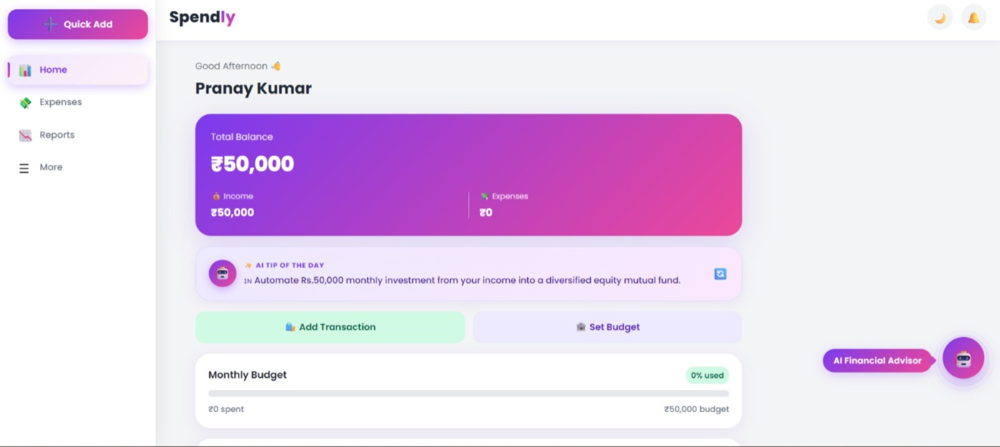

---

## 🤖 AI Financial Advisor

An AI-powered financial assistant designed to help users make smarter financial decisions.

Features:
- Personalized Financial Guidance
- Spending Recommendations
- Budget Optimization
- Savings Suggestions
- Financial Planning Assistance

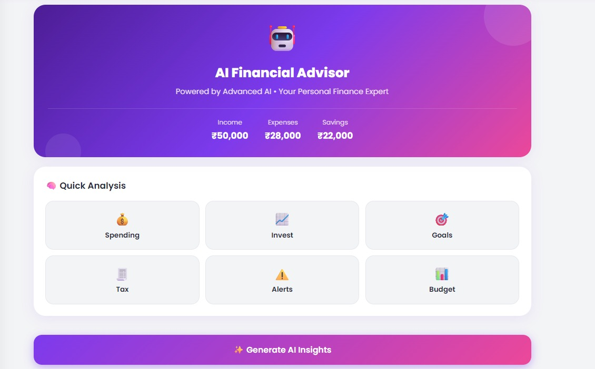

---
## 🧠 AI Memory System

Spendly's AI assistant remembers previous context to provide more meaningful and personalized interactions.

### Benefits

* Context-aware responses
* Personalized recommendations
* Better user experience
* Smarter financial assistance
* Continuous financial guidance

---

## 💬 Intelligent AI Conversations

Interact naturally with Spendly's AI assistant through a modern conversational interface.

Features:
- Context-Aware Responses
- Financial Queries & Advice
- Smart Recommendations
- Personalized Assistance

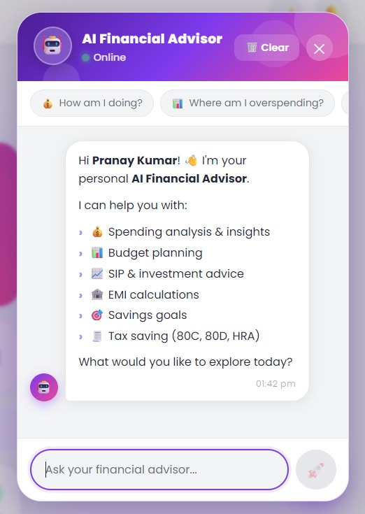

### AI Conversation Example

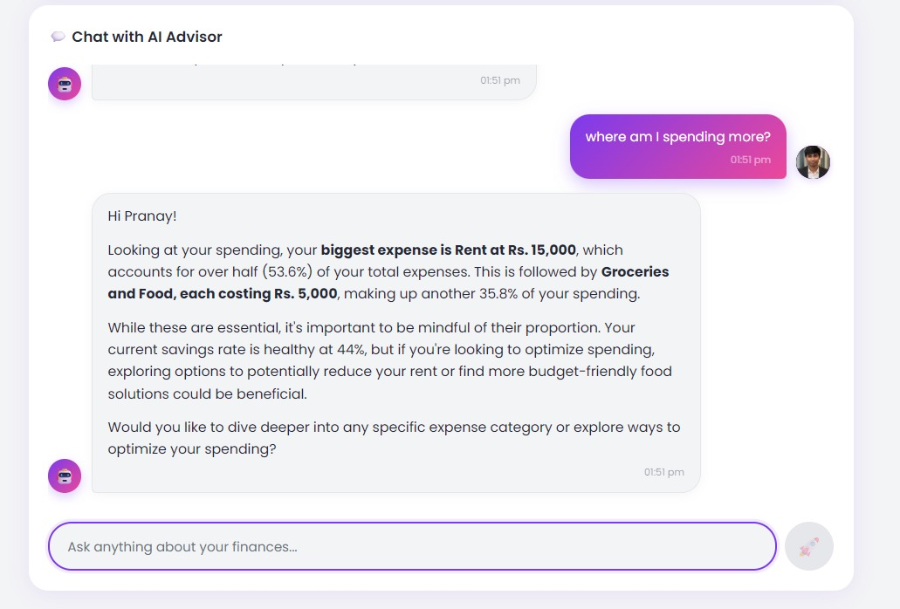

---

## 📊 Analytics & Financial Reports

Gain deeper insights into spending habits through visual reports and analytics.
Visualize your financial health through interactive analytics.

Features:
- Expense Breakdown
- Spending Trends
- Category Analysis
- Financial Reports
- Interactive Visualizations
- Category-wise spending breakdown

### Built With

* Recharts
* Dynamic Data Visualization

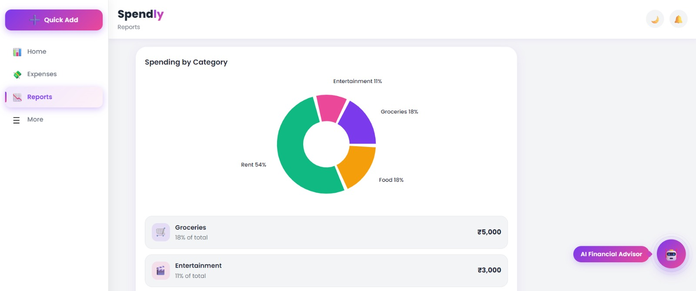

---

## ⚡ Quick Add Transactions

Designed for speed and convenience, allowing users to record transactions instantly.

Features:
- Fast Expense Entry
- Quick Income Logging
- Simplified Workflow
- Improved Productivity

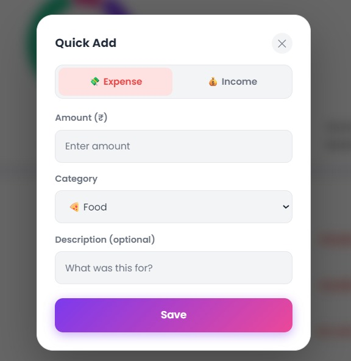

---

## 🌍 Multi-Language Support

Spendly supports multiple languages, making financial management more accessible and inclusive.

Features:
- Enhanced Accessibility
- Localized Experience
- User-Friendly Interface
- Broader Reach

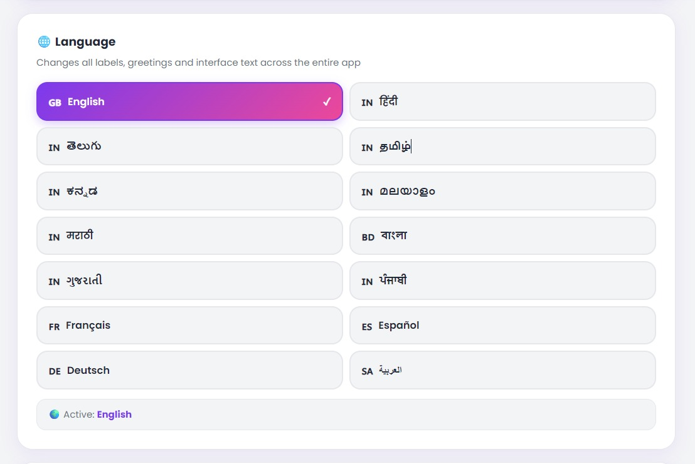

---

## 🎨 Themes & Personalization

Customize the application according to individual preferences.

Features:
- Light Theme
- Dark Theme
- Personalized Experience
- Modern UI Design

### Theme Selection

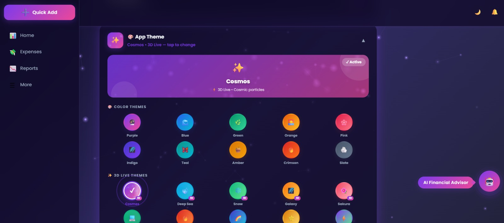

### Dashboard Theme Preview

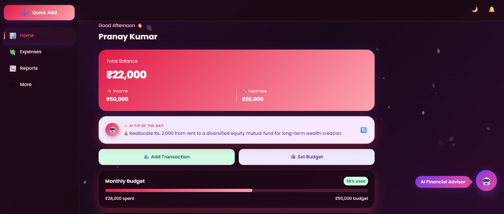

---

## ⚙️ Settings & Customization

Manage application preferences and personalize the overall experience.

Features:
- Profile Management
- Theme Selection
- Language Preferences
- User Customization

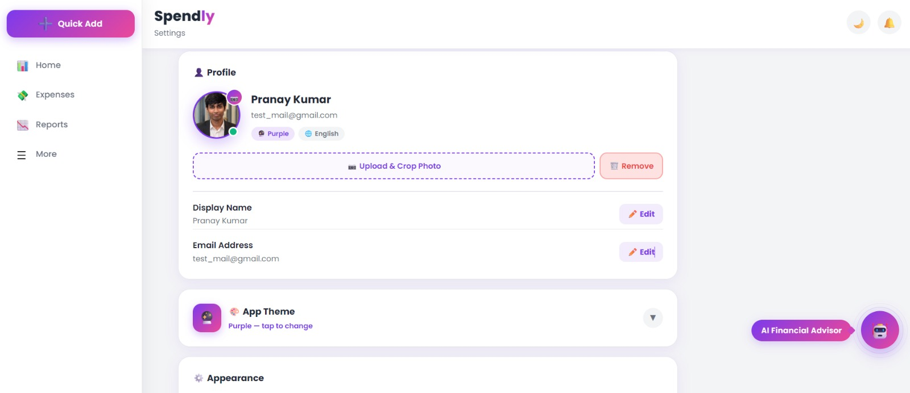

---

## 📱 Fully Responsive Design

Built to provide a seamless experience across all devices.

Supported Devices:
- Desktop
- Laptop
- Tablet
- Mobile

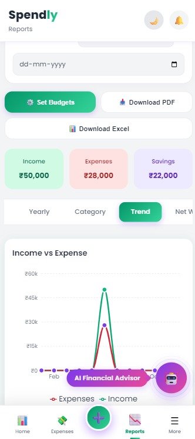

---

## ✨ Additional Features

Spendly includes several additional tools designed to improve financial management and usability.

Features:
- Goal Tracking
- Bill Reminders
- Credit Card Tracking
- Financial Calculators
- Smart Financial Insights

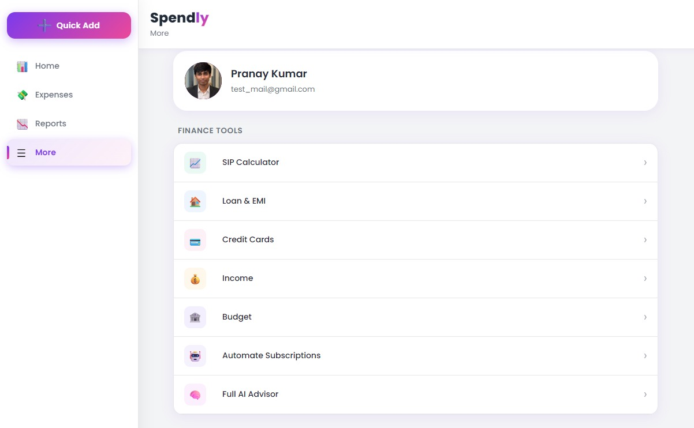

---

## 💰 Expense Tracking

Effortlessly track daily income and expenses.

### Features

* Add and manage transactions
* Income & expense tracking
* Category-based organization
* Transaction history
* Real-time balance updates
* Spending monitoring

---

## 🎯 Budget Management

Create budgets and stay financially disciplined.

### Features

* Monthly budget planning
* Spending limit tracking
* Budget utilization monitoring
* Overspending alerts
* Category-wise budget allocation
* Budget performance insights

---

### AI Integration

* OpenRouter API
* Large Language Models (LLMs)
* Context-aware conversations

---

# 🧮 Financial Calculators

Spendly includes multiple built-in financial calculators.

## 📈 SIP Calculator

Calculate future returns on investments.

### Features

* Wealth projection
* Monthly investment planning
* Return estimation
* Investment growth visualization

---

## 🏦 EMI Calculator

Plan loans efficiently.

### Features

* Monthly EMI calculation
* Total repayment estimation
* Interest analysis
* Loan affordability planning

---

## 🧾 GST Calculator

Quick and accurate GST calculations.

### Features

* GST inclusion calculations
* GST exclusion calculations
* Tax breakdown analysis
* Business-friendly utility

---

## 💳 Credit Card Management

Manage credit card spending effectively.

### Features

* Credit utilization tracking
* Expense monitoring
* Spending analysis
* Financial awareness

---

# 🎯 Goal Tracking

Set and achieve your financial goals.

### Examples

* Emergency Fund
* Travel Savings
* Gadget Purchases
* Investment Targets
* Personal Savings Goals

### Features

* Progress tracking
* Goal monitoring
* Achievement visualization
* Savings recommendations

---

# 🚨 Bill Management

Never miss an important payment.

### Features

* Upcoming bill tracking
* Due-date reminders
* Payment monitoring
* Better financial planning

---

# ⚙️ Technology Stack

## Frontend

* React
* JavaScript
* HTML5
* CSS3

## Animations

* Framer Motion

## Data Visualization

* Recharts

## Backend & Database

* Firebase
* Firestore

## Artificial Intelligence

* OpenRouter API
* Large Language Models (LLMs)

## Deployment

* Vercel

## Version Control

* Git
* GitHub

---

# 🚀 Future Roadmap

Planned enhancements include:

* AI Agents for Finance Management
* Smart Expense Categorization
* Financial Forecasting
* Investment Portfolio Tracking
* Voice Assistant Integration
* Predictive Financial Analytics
* Advanced Budget Planner

---

# 👨‍💻 Developer

### Pranay Kumar Vonamala

**B.Tech Computer Science & Engineering (Information Security)**

Passionate about Software Development, Artificial Intelligence, Agentic AI, Information Security, and Modern Web Development.

### Connect With Me

* GitHub: https://github.com/Pranay-Kumar-02
* LinkedIn: https://www.linkedin.com/in/pranay-kumar-vonamala/
* Email: [vonamala.pranay@gmail.com](mailto:vonamala.pranay@gmail.com)

---

⭐ If you found this project interesting, consider giving it a star.

